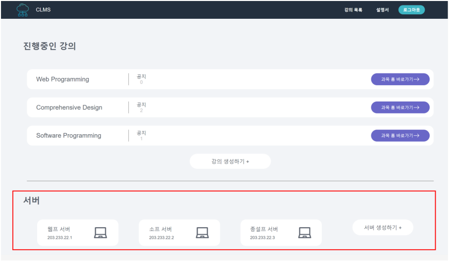
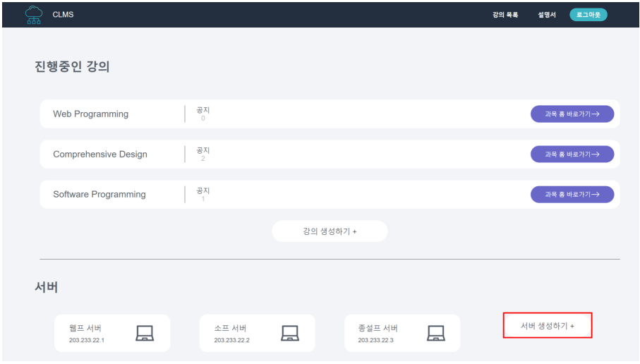

# CLMS-frontend
CLMS 프로젝트의 프론트엔드 파트입니다.
<br/><br/>
## 프로젝트 소개
CLMS는 Cloud 와 LMS를 합친 합성어로 CLMS는 교수자와 학생을 위한 클라우드 컴퓨팅 서비스입니다.
본 프로젝트는 교수자가 쉽고 원활하게 학생들을 위한 교육 환경을 마련하고, 학생들은 원하는 개발 환경을 구축할 수 있도록 기존 클라우드 컴퓨팅 서비스와 학습 관리 시스템을 응용하여 개발 하였습니다. 
<br/><br/><br/>

## 팀원
- 프론트
  - 임채준 ([as1248](https://github.com/as1248))
  - 장우혁 ([CooAnt](https://github.com/CooAnt))

- 백엔드 ([CLMS](https://github.com/DonghyeonKang/CLMS))
  - 강동현 ([DonghyeonKang](https://github.com/DonghyeonKang))
  - 이건호 ([GHL0714](https://github.com/GHL0714))
  - 정수진 ([truemanburbank](https://github.com/truemanburbank))
<br/><br/><br/>

## 기술 스택


- 라이브러리
<div>
  
  
  
  
  
  
</div>
<br/><br/><br/>

## 주요 기능

<h3>교수자</h3>
<details>
<summary>서버 등록</summary><br/>
  
- 서버 요구사항
  - RAM - 최소 4GB 이상
  - 설치 운영체제 - Ubuntu Server 20.04 LTS
  - IP Address - 고정 IP 할당 필요

- 패키지 다운로드 및 설치
1) 다음 명령어를 입력하여 패키지를 CLMS로 부터 설치합니다.
```
    wget http://clms.kro.kr/server/register/installing -o Automation.tar
```
2) 다음 명령어를 차례로 입력하여 tar 아카이브 파일의 압축을 해제합니다.<br/>
(현재 로그인 된 계정의 홈 디렉토리에 위치해야 합니다.)
```
    cd ~
    tar -xvf Automation.tar
```
3) 파일 압축 해제 후 다음 명령어를 입력하여 CLMS 서버 설치 패키지를 실행하면 패키지 설치가 완료됩니다.<br/>
(설치 종료 후 자동으로 리눅스 접속이 종료됩니다.)
```
    sh ./ServerAutomation.sh <사용자 계정 비밀번호>
```
   
- 서버 등록
1) 로그인 후 헤더의 <강의 목록> 버튼을 클릭하여 페이지를 이동합니다.
<br/><br/>
2) 강의 목록 페이지에서 해당 학과에 등록된 서버 목록을 확인합니다.
<br/><br/>
3) <서버 생성하기> 버튼을 클릭하여 서버 등록 페이지로 이동합니다.
<br/><br/>
4) 앞서 CLMS 서버 등록 패키지를 설치한 서버의 구성 정보를 입력한 뒤, <서버 등록> 버튼을 클릭하여 서버를 등록합니다.
<br/><br/>
</details>

<details>
<summary>강의 생성</summary><br/>
1. 로그인 후 헤더의 <강의 목록> 버튼을 클릭하여 페이지를 이동합니다.
<br/><br/>
2. <강의 생성하기> 버튼을 클릭하여 강의 생성 페이지로 이동합니다.
<br/><br/>
3. 강의를 생성하려는 서버를 선택하고 강의 정보를 기입한 뒤 <생성하기> 버튼을 클릭하여 강의를 생성합니다.
<br/><br/>
</details>
    
<h3>학생</h3>
<details>
<summary>수강 신청</summary><br/>
1. 로그인 이후 메인 페이지 상단의 <강의 목록> 버튼을 클릭하여 강의 목록 페이지로 이동합니다.
<br/><br/>
2. 수강중인 강의 목록 아래의 <수강 신청하기> 버튼을 클릭합니다.
<br/><br/>
3. 사용자의 학과에 등록되어 있는 강의 목록에서 원하는 강의의 <신청하기> 버튼을 클릭하면 신청이 완료됩니다.<br/>
(이후 교수자의 승인이 이루어지면 수강중인 강의 목록에 해당 강의가 추가됩니다.)
<br/><br/>
</details>

<details>
<summary>인스턴스 생성</summary><br/>
1. 로그인 후 헤더에서 <강의 목록> 버튼을 클릭하여 강의 목록 페이지로 이동합니다.
<br/><br/>
2. <과목 홈 바로가기> 버튼을 클릭하여 인스턴스를 생성하려는 강의의 홈으로 이동합니다.
<br/><br/>
3. <인스턴스> 버튼을 클릭하여 현재 강의의 인스턴스 정보 페이지로 이동합니다.
<br/><br/>
4. 현재 강의에서 인스턴스가 존재하지 않는 경우, <인스턴스 생성> 버튼을 클릭하여 인스턴스 생성 페이지로 이동합니다.
<br/><br/>
5. <새 키 페어 생성> 버튼을 클릭하여 키 페어 모달창을 띄웁니다.
<br/><br/>
6. 키-페어 생성 폼을 기입 후 키-페어 생성 버튼을 클릭하면 입력한 이름과 파일 형식에 맞게 키-페어가 생성되고 설정에 적용됩니다. 생성한 인스턴스 접속을 위한 개인키(private key)는 로컬 장치로 다운로드 되며, 해당 키 파일을 원하는 위치로 이동하여 저장합니다.<br/>
(경고 : 해당 개인키를 분실하거나 여러 장치에서 사용하는 경우 인스턴스 접속이 차단되므로 분실 및 유출되지 않도록 주의하십시오.)
<br/><br/>
7. 인스턴스 생성 폼에 따라 정보를 기입한 후 <인스턴스 생성> 버튼을 클릭하면 인스턴스가 생성이 완료됩니다.
<br/><br/>
</details>

<details>
<summary>인스턴스 접속</summary><br/>
1. 로그인 이후 메인 페이지 상단의 <강의 목록> 버튼을 클릭하여 강의 목록 페이지로 이동합니다.
<br/><br/>
2.  <과목 홈 바로가기> 버튼을 클릭하여 접속할 인스턴스가 존재하는 강의의 홈으로 이동합니다.
<br/><br/>
3. <인스턴스> 버튼을 클릭하여 인스턴스 페이지로 이동합니다.
<br/><br/>
4. 인스턴스의 Public IPv4 주소와 키-페어 이름을 확인합니다.<br/>
(인스턴스 상태가 ‘동작 중(running.’이 아닐 경우, 우측 상단의 <인스턴스 상태> 리스트를 클릭하여 <인스턴스 시작>을 클릭합니다.)
<br/><br/>
5. 하단의 <보안> 탭을 클릭하여 인스턴스의 port 번호를 확인합니다.
<br/><br/>
6. OS의 터미널을 실행하여 개인키가 저장된 디렉토리로 이동한 후, 다음과 같은 명령어를 입력하여 인스턴스에 접속합니다.

    ssh -i "<개인키 이름>" <계정명>@<접속할 서버 IP Address> -p <port 번호>

</details>
